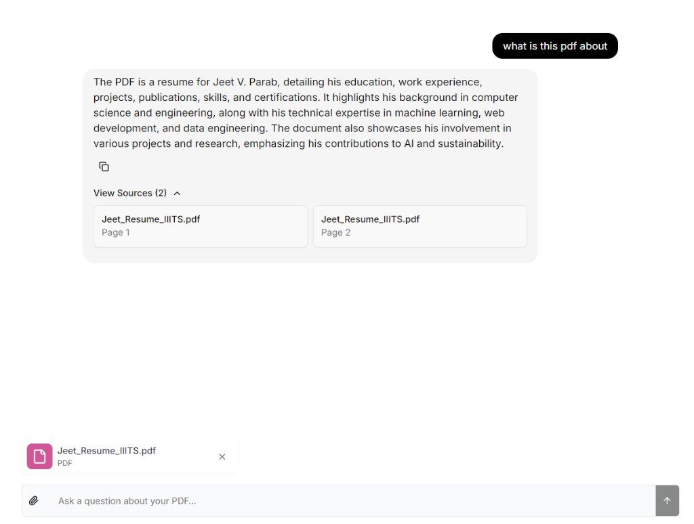

# RAG PDF Chat

Chat with your PDF documents using **retrieval-augmented generation (RAG)**. Upload a PDF, store embeddings in **Supabase**, and ask questions with **streaming answers** and **source citations**.



## What you see in the app

1. **Upload** one or more PDFs (up to 100MB each, max 5 files).
2. The app **chunks** the text and creates **embeddings** via OpenAI.
3. Vectors are stored in **Supabase** for similarity search.
4. You **ask questions** in natural language.
5. The agent **retrieves** relevant chunks and **streams** an answer.
6. Click **View Sources** to see which PDF pages were used.

The screenshot above shows a real session: a resume PDF was uploaded, summarized, and cited by **filename** and page number (not temp file paths).

## How it works

```
┌──────────────┐   upload PDF    ┌─────────────────┐
│  Web (Next)  │ ──────────────► │ OpenAI embeddings│
│  :3000       │                 │ + Supabase store │
└──────┬───────┘                 └─────────────────┘
       │ ask question
       ▼
┌──────────────┐   retrieve +    ┌─────────────────┐
│  LangGraph   │ ◄────────────── │ Supabase vectors │
│  agent :2024 │   generate      └─────────────────┘
└──────────────┘
```

| Component | Folder | Purpose |
|-----------|--------|---------|
| Web UI | `web/` | Next.js chat, file upload, API routes |
| Agent | `agent/` | LangGraph graphs: `document_ingest`, `document_qa` |
| Vector DB | Supabase | Stores document chunks + embeddings |
| LLM | OpenAI | Embeddings + chat (`gpt-4o-mini` by default) |

## Features

- PDF upload with validation (type, size, count)
- Direct Supabase ingestion from the web API (reliable on Windows)
- LangGraph agent for Q&A with retrieval routing
- Streaming SSE responses
- Source citations with page references
- Health check: `GET /api/health`
- Optional LangSmith tracing

## Prerequisites

- **Node.js 20+** and **npm**
- **OpenAI API key** with billing/credits ([billing](https://platform.openai.com/account/billing))
- **Supabase** project ([supabase.com](https://supabase.com))

## Supabase setup (one time)

In your Supabase project → **SQL Editor** → **New query**, run:

```sql
create extension if not exists vector with schema extensions;

create table if not exists documents (
  id bigserial primary key,
  content text,
  metadata jsonb,
  embedding extensions.vector(1536)
);

create or replace function match_documents (
  query_embedding extensions.vector(1536),
  match_count int default null,
  filter jsonb default '{}'
)
returns table (
  id bigint,
  content text,
  metadata jsonb,
  similarity float
)
language plpgsql
as $$
#variable_conflict use_column
begin
  return query
  select id, content, metadata,
    1 - (documents.embedding <=> query_embedding) as similarity
  from documents
  where metadata @> filter
  order by documents.embedding <=> query_embedding
  limit match_count;
end;
$$;
```

From **Settings → API** copy:

- **Project URL** → `SUPABASE_URL` (e.g. `https://YOUR_ID.supabase.co`)
- **Secret key** (`sb_secret_...`) → `SUPABASE_SERVICE_ROLE_KEY`

## Installation

```bash
git clone <your-repo-url>
cd RAG

npm install --legacy-peer-deps

cp agent/.env.example agent/.env
cp web/.env.example web/.env
```

Edit **`agent/.env`**:

```env
OPENAI_API_KEY=sk-proj-...
SUPABASE_URL=https://your-project.supabase.co
SUPABASE_SERVICE_ROLE_KEY=sb_secret_...
```

Edit **`web/.env`** (defaults usually work locally):

```env
NEXT_PUBLIC_LANGGRAPH_API_URL=http://localhost:2024
LANGGRAPH_INGESTION_ASSISTANT_ID=document_ingest
LANGGRAPH_RETRIEVAL_ASSISTANT_ID=document_qa
```

## Run locally

**Two terminals** (or one command):

```bash
# Option A — both at once
npm run dev

# Option B — separate terminals
npm run dev:agent   # port 2024 — required for chat
npm run dev:web     # port 3000 — UI
```

Open [http://localhost:3000](http://localhost:3000).

- **Health:** [http://localhost:3000/api/health](http://localhost:3000/api/health)
- **Agent:** [http://localhost:2024/info](http://localhost:2024/info)

## Usage

1. Click the **paperclip** and select a PDF (requires the chat agent to be running so a **thread** exists).
2. Wait for the success toast (needs OpenAI quota).
3. Type a question, e.g. *“What is this document about?”*
4. Read the streamed answer and open **View Sources** (shows the PDF **filename** and page number).

Each chat thread only retrieves chunks tagged with that thread’s ID, so uploads from other sessions do not leak into answers.

## Troubleshooting

| Problem | Fix |
|---------|-----|
| Chat input greyed out | Run `npm run dev:agent`, refresh the page |
| `ERR_CONNECTION_REFUSED` on `:2024` | Agent not running — start `npm run dev:agent` |
| `OpenAI quota exceeded` | Add credits at [platform.openai.com/account/billing](https://platform.openai.com/account/billing) |
| `503` on `/api/threads` | Same — agent must be on port 2024 |
| Radix / `.next` vendor error | Delete `web/.next` and restart `npm run dev:web` |
| Upload works, chat empty | PDF may not be indexed — check OpenAI billing |

Check OpenAI key length (~164 chars for `sk-proj-...`):

```bash
node scripts/check-openai-env.mjs
```

## Project structure

```
RAG/
├── agent/                 # LangGraph service
│   ├── src/document_ingest/
│   ├── src/document_qa/
│   └── langgraph.json
├── web/                   # Next.js app
│   ├── app/api/ingest|chat|threads|health
│   └── app/page.tsx
├── docs/
│   └── screenshot-chat.png
└── package.json
```

## Scripts

| Command | Description |
|---------|-------------|
| `npm run dev` | Start agent + web together |
| `npm run dev:agent` | LangGraph only (port 2024) |
| `npm run dev:web` | Next.js only (port 3000) |
| `npm run build` | Production build |

## Customization

- Upload limits: `web/constants/upload-limits.ts`
- Model / retrieval `k`: `web/constants/agent-settings.ts`
- QA prompts: `agent/src/document_qa/prompts.ts`

## License

MIT
